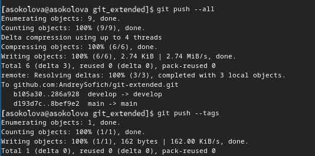

---
## Front matter
lang: ru-RU
title: Презентация по лабораторной работе №4
subtitle: Операционные системы
author:
  - Соколова А.О.  НКАбд-05-23
institute:
  - Российский университет дружбы народов, Москва, Россия
date: 08.03.2024

## i18n babel
babel-lang: russian
babel-otherlangs: english

## Formatting pdf
toc: false
toc-title: Содержание
slide_level: 2
aspectratio: 169
section-titles: true
theme: metropolis
header-includes:
 - \metroset{progressbar=frametitle,sectionpage=progressbar,numbering=fraction}
 - '\makeatletter'
 - '\beamer@ignorenonframefalse'
 - '\makeatother'
---

## Цель работы

Получение навыков правильной работы с репозиториями git

## Задание

Провести работу с репозиториями

## Теоретическое введение

Gitflow Workflow опубликована и популяризована Винсентом Дриссеном.Gitflow Workflow предполагает выстраивание строгой модели ветвления с учётом выпуска проекта.
Данная модель отлично подходит для организации рабочего процесса на основе релизов.
Работа по модели Gitflow включает создание отдельной ветки для исправлений ошибок в рабочей среде.
Последовательность действий при работе по модели Gitflow:
Из ветки master создаётся ветка develop.
Из ветки develop создаётся ветка release.
Из ветки develop создаются ветки feature.
Когда работа над веткой feature завершена, она сливается с веткой develop.
Когда работа над веткой релиза release завершена, она сливается в ветки develop и master.
Если в master обнаружена проблема, из master создаётся ветка hotfix.
Когда работа над веткой исправления hotfix завершена, она сливается в ветки develop и master.

# Выполнение лабораторной работы

## Выполнение лабораторной работы
Устанавливаю gitflow (рис. 4.1).

{#fig:001 width=70%}

## Выполнение лабораторной работы
Устанавливаю gitflow (рис. 4.2).

{#fig:002 width=70%}

## Выполнение лабораторной работы
Добавляю каталог с исполняемыми файлами. Запускаю его с помощью команды pnpm setup (рис. 4.3).

{#fig:003 width=70%}

## Выполнение лабораторной работы
Далее выполню команды source ~/.bashcr и pnpm add g commitizen (рис. 4.4).

{#fig:004 width=70%}

## Выполнение лабораторной работы
Добавляю команду для помощи в создании логов (рис. 4.5).

{#fig:005 width=70%}

## Выполнение лабораторной работы
Создаю пустой файл в новый репозиторий, делаю первый коммит и выкладываю на гитхаб  (рис. 4.6).

{#fig:006 width=70%}

## Выполнение лабораторной работы
Выполняю конфигурацию пакетов NODE.js (рис. 4.7).

{#fig:007 width=70%}

## Выполнение лабораторной работы
Изменяю файл package.json (рис. 4.8).

{#fig:008 width=70%}

## Выполнение лабораторной работы
Добавляю новые файлы, выполняю коммит и добавляю файлы на репозиторий (рис. 4.9).

{#fig:009 width=70%}

## Выполнение лабораторной работы
Инициализирую gitflow и устанавливаю префикс для ярлыков(рис. 4.10).

{#fig:010 width=70%}

## Выполнение лабораторной работы
Проверяю, что нахожусь на ветке develop (рис. 4.11).

{#fig:011 width=70%}

## Выполнение лабораторной работы
Отправляю весь репозиторий в хранилище (рис. 4.12).

{#fig:012 width=70%}

## Выполнение лабораторной работы
Устанавливаю внешнюю ветку как вышестоящую для этой ветки (рис. 4.13).

{#fig:013 width=70%}

## Выполнение лабораторной работы
Создаю релиз с версией 1.0.0 (рис. 4.14).

{#fig:014 width=70%}

## Выполнение лабораторной работы
Создаю журнал изменений и добавлю его в индекс (рис. 4.15).

{#fig:015 width=70%}

## Выполнение лабораторной работы
Заливаю релизную ветку в основную ветку (рис. 4.16).

{#fig:016 width=70%}

## Выполнение лабораторной работы
Отправляю все данные в хранилище (рис. 4.17).

{#fig:017 width=70%}

## Выполнение лабораторной работы
Создаю релиз на Github (рис. 4.18).

{#fig:018 width=70%}

## Выполнение лабораторной работы
Создаю ветку для новой функциональности (рис. 4.19).

{#fig:019 width=70%}

## Выполнение лабораторной работы
Обновляю файл package.json и создаю журнал измененийб добавля журнал в индекс и заливаю ветку в основную (рис. 4.20).

{#fig:020 width=70%}

## Выполнение лабораторной работы
Отправляю все данные на Github (рис. 4.21).

{#fig:021 width=70%}

## Выполнение лабораторной работы
Создаю релиз с комментарием из журнала изменений (рис. 4.22)

{#fig:022 width=70%}

## Выводы

В ходе работы я получила навыки правильной работы с git

## Список литературы

::: {Лабораторная работа №4 - электронная версия} URL: https://esystem.rudn.ru/mod/page/view.php?id=1098794
:::
